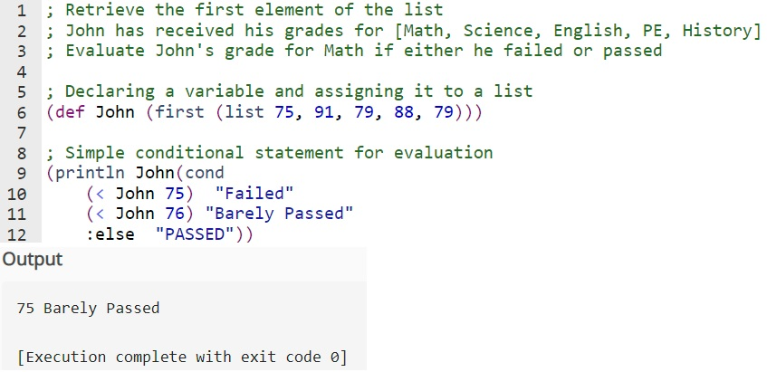

# A machine problem that requires List Implementation using Clojure

## What is Clojure
>[Clojure](https://clojure.org/index) is a dynamic, general-purpose programming language, combining the approachability and interactive development of a scripting language with an efficient and robust infrastructure for multithreaded programming. Clojure is a compiled language, yet remains completely dynamic – every feature supported by Clojure is supported at runtime. Clojure provides easy access to the Java frameworks, with optional type hints and type inference, to ensure that calls to Java can avoid reflection. 

- ## **Retrieve first element of a list**

### Insights
>The things I have learned and observed in Clojure, is that constructing and accessing the elements in a list is quite complex, because lists are evaluated by invoking the first element as a function, we must quote a list to prevent evaluation. like *name of list* '(elements) this.
>Lists in Clojure are not indexed so they must be walked using *first* to access the first element of the list and *rest* to retrieve the elements of a list except the first element. Lists are also sequential linked lists that add new elements at the head of the list, instead of at the tail like vectors.
